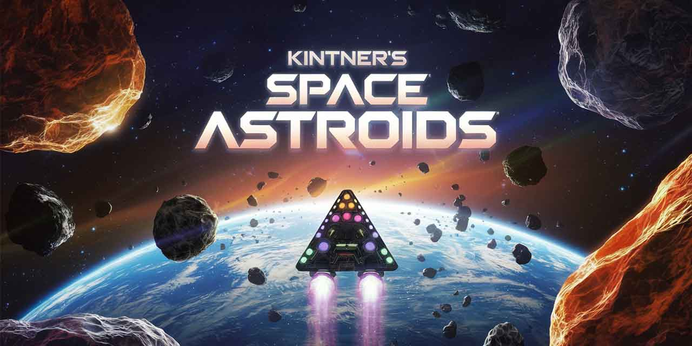

# Asteroids

A modern SwiftUI implementation of the classic Asteroids arcade game for iOS devices, built using SpriteKit.

## Overview

This project is a faithful recreation of the classic Asteroids arcade game, with modern touches and mobile-friendly controls. The game features smooth animations, intuitive touch controls, and progressively challenging gameplay.

## Features

- **Classic Gameplay**: Navigate a spaceship through an asteroid field, shooting and destroying asteroids while avoiding collisions
- **Touch Controls**: Intuitive touch-based controls designed specifically for mobile devices
- **Progressive Difficulty**: The game becomes more challenging as you advance through levels
- **Lives System**: Players have multiple lives to navigate the dangerous asteroid field
- **High Score Tracking**: Keep track of your best performances
- **Smooth Animations**: Built with SpriteKit for fluid, responsive gameplay
- **Splash Screen**: Attractive entry point to the game with intuitive navigation
- **Help Screens**: Instructions for new players to understand the game mechanics

## Technologies Used

- **SwiftUI**: For building the user interface components
- **SpriteKit**: For game scene rendering and physics
- **GameplayKit**: For game logic
- **Google Mobile Ads**: For monetization

## Requirements

- iOS 16.0+
- Xcode 14.0+
- Swift 5.0+

## Installation

1. Clone this repository
2. Open `Asteroids.xcodeproj` in Xcode
3. Select your target device or simulator
4. Build and run the application

## Game Controls

- **Rotate Ship**: Swipe left or right across the screen
- **Thrust**: Tap and hold in the bottom portion of the screen
- **Fire**: Tap anywhere on the upper portion of the screen
- **Double-Tap Thrust**: Double tap for an immediate thrust boost

## Project Structure

- `AsteroidsApp.swift`: Main application entry point
- `ContentView.swift`: Main container view
- `GameView.swift`: SpriteKit view container
- `GameScene.swift`: Main game logic and rendering
- `SplashScene.swift` & `SplashView.swift`: Welcome screen and menu
- `Player.swift`: Player ship logic
- `GameTypes.swift`: Enums and structs for game state
- `HighScore.swift`: Score tracking functionality
- `HelpScreenProvider.swift`: Game instructions

## Notes for Making the Project Public

1. **AdMob ID**: The project contains a Google AdMob test ID in Info.plist (`ca-app-pub-3940256099942544~1458002511`). This is Google's official test ID, but for production, you'll need to replace it with your own AdMob ID.

2. **SKAdNetwork IDs**: The Info.plist contains SKAdNetwork identifiers for ad networks which are required for App Store compliance but don't contain sensitive information.

## License

[MIT License](LICENSE)

## Credits

Developed by Michael Kintner

## Future Improvements

- Multiplayer support
- Additional power-ups and weapons
- More enemy types
- Alternative control schemes
- Theme customization 